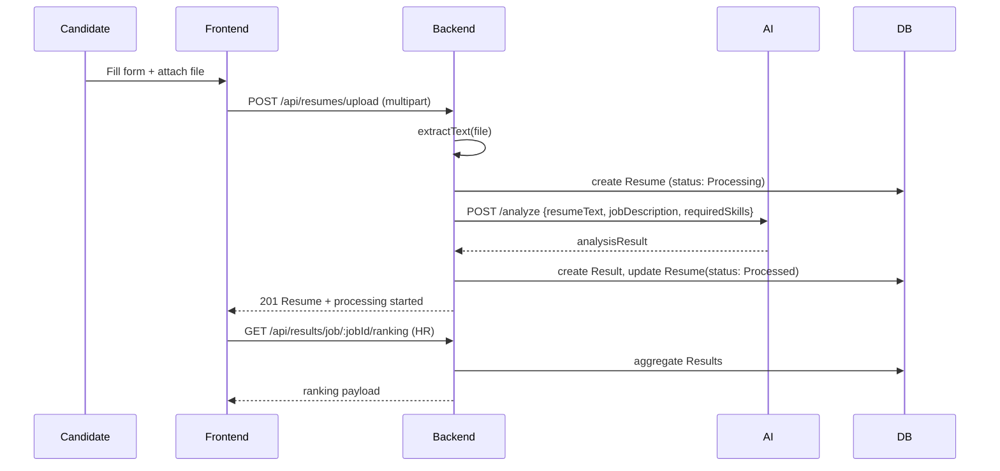
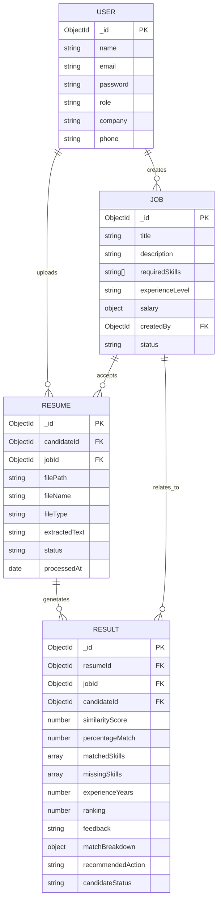

UML Diagrams (Mermaid)

All diagrams reflect implemented functionality and endpoints.

1) Use Case Diagram

```mermaid
%%{init: {"theme": "default"}}%%
flowchart TB
  actor_HR(((HR))])
  actor_Candidate(((Candidate))])
  subgraph System[AI Resume Screening System]
    UC1([Register / Login])
    UC2([Create / Manage Jobs])
    UC3([Browse Jobs])
    UC4([Upload Resume])
    UC5([Process Resume / Analyze])
    UC6([View Results / Ranking])
    UC7([View Analytics])
    UC8([Download Sample Resumes])
    UC9([Update Result Notes / Status])
  end
  actor_Candidate --> UC1
  actor_Candidate --> UC3
  actor_Candidate --> UC4
  actor_HR --> UC1
  actor_HR --> UC2
  actor_HR --> UC6
  actor_HR --> UC7
  actor_HR --> UC9
  UC8 <-- actor_Candidate
  UC8 <-- actor_HR
```

2) Activity Diagram — Resume Upload & Processing

```mermaid
flowchart TD
  A[Candidate uploads resume (POST /api/resumes/upload)] --> B[Backend extracts text (pdf-parse, mammoth)]
  B --> C[Resume saved as Document (status: Processing)]
  C --> D[Backend calls AI Module: POST /analyze]
  D --> E[AI Module preprocesses -> TF-IDF -> cosine similarity -> scoring]
  E --> F[Backend saves Result document and marks resume Processed]
  F --> G[HR/Candidate can fetch result (GET /api/results/:id / GET /api/resumes/:id)]
```

3) Sequence Diagram — Resume Analyze Flow



4) ERD — Data Model



Notes

- The ERD matches Mongoose models in `backend/src/models/` and uses implemented relationships: `createdBy`, `candidateId`, `jobId`, and `resumeId`.
